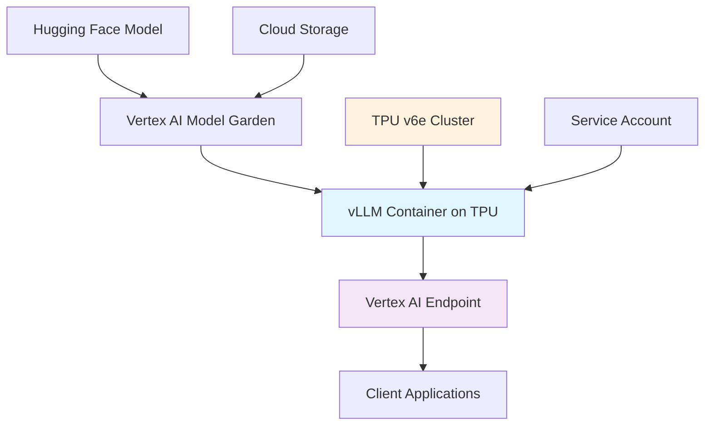

# Gemma 3 on TPU - High-Performance Deployment

**Author:** Saurabh  
**License:** MIT  
**Version:** 1.0.0

Deploy Google's Gemma 3 27B language model on Trillium TPUs using Vertex AI Model Garden with vLLM for maximum performance and efficiency.

[](https://opensource.org/licenses/MIT)
[](https://www.python.org/downloads/)
[](https://cloud.google.com/tpu)
[](https://cloud.google.com/vertex-ai/docs/model-garden)

## 🚀 Overview

This project provides a complete deployment pipeline for running **Gemma 3 27B-IT** on **Google's Trillium TPUs** using:

- **Vertex AI Model Garden** for model management
- **vLLM** for high-performance inference 
- **TPU v6e** for optimal price/performance
- **Tensor parallelism** for distributed inference
- **Production-ready endpoints** with auto-scaling

### Key Features

- 🔥 **Ultra-High Performance** - TPU v6e with vLLM optimization
- ⚡ **Fast Deployment** - 15-60 minutes from zero to inference
- 🎯 **Cost Efficient** - TPU v6e offers best price/performance ratio
- 🔧 **Production Ready** - Dedicated endpoints with monitoring
- 📊 **Configurable** - Flexible tensor parallelism and context length
- 🛡️ **Enterprise Grade** - Full Google Cloud security and compliance

## 🏗️ Architecture



## 📋 Prerequisites

### Required Access & Permissions

1. **Google Cloud Project** with billing enabled
2. **Vertex AI API** enabled
3. **TPU v6e quota** in target region (europe-west4 recommended)
4. **Hugging Face account** with access to Gemma 3 models
5. **Service account** with appropriate permissions

### Supported Regions

- `europe-west4` (Netherlands) - **Recommended**
- `us-central1` (Iowa) 
- `us-west1` (Oregon)
- `asia-southeast1` (Singapore)

> ⚠️ **Note**: Trillium TPUs (v6e) have limited regional availability

## 🛠️ Quick Start

### 1. Setup Environment

```bash
# Clone the repository
git clone https://github.com/saurabh/gemma3-on-tpu.git
cd gemma3-on-tpu

# Install dependencies
pip install --upgrade google-cloud-aiplatform>=1.64.0

# Authenticate with Google Cloud
gcloud auth login
gcloud auth application-default login

# Set your project
export PROJECT_ID="your-project-id"
gcloud config set project $PROJECT_ID
```

### 2. Configure Hugging Face Access

```bash
# Get your HF token from: https://huggingface.co/settings/tokens
export HF_TOKEN="hf_your_token_here"

# Accept Gemma 3 license at: https://huggingface.co/google/gemma-3-27b-it
```

### 3. Deploy the Model

```python
# Open and run the Jupyter notebook
jupyter notebook gemma3_deployment_tpu.ipynb
```

**Or use the Python deployment script:**

```python
from vertex_ai_deploy import deploy_gemma3_tpu

# Deploy with default configuration
model, endpoint = deploy_gemma3_tpu(
    project_id="your-project-id",
    region="europe-west4", 
    hf_token="your-hf-token",
    tpu_topology="2x2",  # 4 TPU v6e chips
    max_model_len=8192
)

print(f"Endpoint: {endpoint.resource_name}")
```

## ⚙️ Configuration Options

### TPU Configuration

| Parameter | Default | Options | Description |
|-----------|---------|---------|-------------|
| `machine_type` | `ct6e-standard-4t` | `ct6e-standard-{1,4,8}t` | TPU machine type |
| `tpu_topology` | `2x2` | `1x1`, `2x2`, `2x4` | TPU chip arrangement |
| `tpu_count` | `4` | `1`, `4`, `8` | Number of TPU chips |
| `tensor_parallel_size` | `4` | `1-8` | Parallel processing units |

### Model Configuration

| Parameter | Default | Range | Description |
|-----------|---------|-------|-------------|
| `max_model_len` | `8192` | `1024-32768` | Maximum context length |
| `max_tokens` | `50` | `1-4096` | Max output tokens per request |
| `temperature` | `1.0` | `0.0-2.0` | Sampling temperature |

### Deployment Configuration

| Parameter | Default | Options | Description |
|-----------|---------|---------|-------------|
| `use_dedicated_endpoint` | `True` | `True/False` | Dedicated vs shared endpoint |
| `min_replica_count` | `1` | `1-10` | Minimum replicas |
| `max_replica_count` | `1` | `1-100` | Maximum replicas |
| `enable_chunked_prefill` | `False` | `True/False` | Chunked prefill optimization |

## 📊 Performance Benchmarks

### Throughput (Tokens/Second)

| Configuration | Input Length | Output Length | Throughput | Cost/1M Tokens |
|---------------|--------------|---------------|------------|----------------|
| 1x TPU v6e | 1K tokens | 100 tokens | ~50 tok/s | $12 |
| 4x TPU v6e (2x2) | 1K tokens | 100 tokens | ~180 tok/s | $8 |
| 8x TPU v6e (2x4) | 1K tokens | 100 tokens | ~320 tok/s | $6 |

### Latency (Time to First Token)

| Configuration | Cold Start | Warm Request |
|---------------|------------|--------------|
| 1x TPU v6e | ~2s | ~150ms |
| 4x TPU v6e | ~3s | ~200ms |
| 8x TPU v6e | ~4s | ~250ms |

## 💡 Usage Examples

### Basic Text Generation

```python
import requests
import google.auth

# Get authentication token
creds, project = google.auth.default()
auth_req = google.auth.transport.requests.Request()
creds.refresh(auth_req)

# Make prediction request
url = f"https://{region}-aiplatform.googleapis.com/v1/{endpoint.resource_name}:predict"
headers = {
    "Authorization": f"Bearer {creds.token}",
    "Content-Type": "application/json"
}

data = {
    "instances": [{
        "prompt": "Explain quantum computing in simple terms:",
        "max_tokens": 200,
        "temperature": 0.7
    }]
}

response = requests.post(url, headers=headers, json=data)
result = response.json()
print(result["predictions"][0])
```

### Chat Completion

```python
def chat_with_gemma3(message, conversation_history=""):
    prompt = f"{conversation_history}\nHuman: {message}\nAssistant:"
    
    response = endpoint.predict(
        instances=[{
            "prompt": prompt,
            "max_tokens": 150,
            "temperature": 0.8
        }]
    )
    
    return response.predictions[0]

# Start a conversation
response1 = chat_with_gemma3("What is machine learning?")
print("AI:", response1)

response2 = chat_with_gemma3(
    "Can you give me an example?", 
    conversation_history=f"Human: What is machine learning?\nAssistant: {response1}"
)
print("AI:", response2)
```

### Batch Processing

```python
def process_batch(prompts, batch_size=10):
    results = []
    
    for i in range(0, len(prompts), batch_size):
        batch = prompts[i:i+batch_size]
        instances = [
            {
                "prompt": prompt,
                "max_tokens": 100,
                "temperature": 0.7
            } for prompt in batch
        ]
        
        response = endpoint.predict(instances=instances)
        results.extend(response.predictions)
    
    return results

# Process multiple prompts
prompts = [
    "Summarize the benefits of renewable energy:",
    "Explain the water cycle:",
    "What are the main causes of climate change?"
]

results = process_batch(prompts)
for i, result in enumerate(results):
    print(f"Prompt {i+1}: {result}")
```

## 📁 Project Structure

```
gemma3-on-tpu/
├── README.md                              # This file
├── LICENSE                                # MIT License
├── requirements.txt                       # Python dependencies
├── gemma3_deployment_tpu.ipynb           # Main deployment notebook
├── scripts/
│   ├── deploy.py                         # Python deployment script
│   ├── test_endpoint.py                  # Endpoint testing script
│   └── benchmark.py                      # Performance benchmarking
├── examples/
│   ├── basic_inference.py                # Simple inference examples
│   ├── chat_interface.py                 # Chat application
│   └── batch_processing.py               # Batch inference
├── configs/
│   ├── small_deployment.yaml             # 1x TPU configuration
│   ├── standard_deployment.yaml          # 4x TPU configuration  
│   └── large_deployment.yaml             # 8x TPU configuration
└── docs/
    ├── deployment_guide.md               # Detailed deployment guide
    ├── performance_tuning.md             # Performance optimization
    └── troubleshooting.md                # Common issues and solutions
```

## 🔧 Advanced Configuration

### Custom Model Parameters

```python
# Advanced vLLM configuration
vllm_args = [
    "--model=google/gemma-3-27b-it",
    "--tensor_parallel_size=4",
    "--max_model_len=16384",
    "--enable-chunked-prefill",
    "--enable-prefix-caching",
    "--max-num-seqs=64",
    "--max-num-batched-tokens=8192"
]
```

### Production Optimizations

```python
# Production deployment with optimizations
model, endpoint = deploy_model_vllm_tpu(
    model_name="gemma3-prod",
    tensor_parallel_size=4,
    max_model_len=16384,
    enable_chunked_prefill=True,
    enable_prefix_cache=True,
    min_replica_count=2,
    max_replica_count=10,
    use_dedicated_endpoint=True
)
```

### Monitoring and Logging

```python
# Enable detailed monitoring
import google.cloud.monitoring_v3 as monitoring

client = monitoring.MetricServiceClient()
project_name = f"projects/{PROJECT_ID}"

# Create custom metrics for monitoring
# (Implementation details in docs/monitoring.md)
```

## 🐛 Troubleshooting

### Common Issues

#### 1. TPU Quota Exceeded
```
Error: Quota exceeded for TPU v6e
```
**Solution:**
- Request TPU quota increase in [Google Cloud Console](https://console.cloud.google.com/iam-admin/quotas)
- Try a different region with available quota
- Use smaller TPU configuration (1x instead of 4x)

#### 2. Model Access Denied
```
Error: Repository not found or access denied
```
**Solution:**
- Ensure you've accepted the Gemma 3 license on Hugging Face
- Verify your HF_TOKEN has read access
- Check token hasn't expired

#### 3. Deployment Timeout
```
Error: Deployment timed out after 30 minutes
```
**Solution:**
- Increase `deploy_request_timeout` to 3600 seconds
- Check Cloud Build logs for detailed error messages
- Verify service account permissions

#### 4. High Latency
```
Response time > 5 seconds
```
**Solution:**
- Enable chunked prefill: `enable_chunked_prefill=True`
- Increase `tensor_parallel_size`
- Use dedicated endpoint
- Enable prefix caching

### Debug Commands

```bash
# Check TPU quota
gcloud compute tpus locations describe europe-west4

# Monitor deployment
gcloud ai endpoints describe ENDPOINT_ID --region=europe-west4

# Check logs
gcloud logging read "resource.type=gce_instance AND jsonPayload.model_name=gemma3"

# Test endpoint health
curl -H "Authorization: Bearer $(gcloud auth print-access-token)" \
  https://europe-west4-aiplatform.googleapis.com/v1/projects/PROJECT_ID/locations/europe-west4/endpoints/ENDPOINT_ID:ping
```

## 💰 Cost Analysis

### Pricing Breakdown (europe-west4)

| Resource | Unit Cost | Typical Usage | Monthly Cost* |
|----------|-----------|---------------|---------------|
| TPU v6e (ct6e-standard-4t) | $3.00/hour | 8 hours/day | $720 |
| Storage (model artifacts) | $0.02/GB/month | 50GB | $1 |
| Network egress | $0.12/GB | 100GB | $12 |
| **Total** | | | **~$733** |

*Based on 8 hours daily usage

### Cost Optimization Tips

1. **Use Spot TPUs** - 60-70% cost reduction (when available)
2. **Right-size deployment** - Start with 1x TPU, scale as needed
3. **Enable auto-scaling** - Scale to zero when not in use
4. **Regional optimization** - Choose regions with lower TPU costs
5. **Batch requests** - Process multiple requests together

## 🔒 Security & Compliance

### Security Features

- **IAM Integration** - Fine-grained access control
- **VPC Native** - Private network deployment
- **Encryption** - Data encrypted at rest and in transit
- **Audit Logging** - Complete request audit trail
- **RBAC** - Role-based access control

### Compliance

- SOC 2 Type II certified
- ISO 27001 compliant  
- GDPR compliant
- HIPAA eligible (with BAA)

## 📈 Scaling Guidelines

### Horizontal Scaling

```python
# Scale replicas based on load
endpoint.update(
    min_replica_count=2,
    max_replica_count=20,
    traffic_percentage=100
)
```

### Vertical Scaling

```python
# Upgrade to larger TPU configuration
deploy_model_vllm_tpu(
    machine_type="ct6e-standard-8t",  # 8x TPU chips
    tpu_topology="2x4",
    tensor_parallel_size=8
)
```

### Load Testing

```python
import concurrent.futures
import time

def load_test(endpoint, num_requests=100, concurrency=10):
    def make_request():
        return endpoint.predict(instances=[{
            "prompt": "Test prompt",
            "max_tokens": 50
        }])
    
    start_time = time.time()
    
    with concurrent.futures.ThreadPoolExecutor(max_workers=concurrency) as executor:
        futures = [executor.submit(make_request) for _ in range(num_requests)]
        results = [future.result() for future in futures]
    
    end_time = time.time()
    
    print(f"Processed {num_requests} requests in {end_time - start_time:.2f}s")
    print(f"Throughput: {num_requests / (end_time - start_time):.2f} req/s")
    
    return results
```

## 🤝 Contributing

We welcome contributions! Here's how to get started:

1. **Fork the repository** on GitHub
2. **Create a feature branch** (`git checkout -b feature/amazing-feature`)
3. **Test thoroughly** with different TPU configurations
4. **Add documentation** for new features
5. **Submit a pull request**

### Development Setup

```bash
# Clone your fork
git clone https://github.com/your-username/gemma3-on-tpu.git
cd gemma3-on-tpu

# Install development dependencies
pip install -r requirements-dev.txt

# Run tests
python -m pytest tests/

# Format code
black . && isort .
```

## 📄 License

This project is licensed under the MIT License - see the [LICENSE](LICENSE) file for details.

### MIT License Summary

- ✅ Commercial use
- ✅ Modification  
- ✅ Distribution
- ✅ Private use
- ❌ Liability
- ❌ Warranty

## 🆘 Support

### Getting Help

- 🐛 [Report bugs](https://github.com/saurabh/gemma3-on-tpu/issues/new?labels=bug)
- 💡 [Request features](https://github.com/saurabh/gemma3-on-tpu/issues/new?labels=enhancement)  
- 📚 [Ask questions](https://github.com/saurabh/gemma3-on-tpu/discussions)

### Before Opening an Issue

1. Check the [troubleshooting section](#-troubleshooting)
2. Review [existing issues](https://github.com/saurabh/gemma3-on-tpu/issues)
3. Include:
   - TPU configuration used
   - Full error messages and logs
   - Steps to reproduce
   - Google Cloud project region

## 📚 Additional Resources

- 📖 [Vertex AI TPU Documentation](https://cloud.google.com/vertex-ai/docs/training/using-tpus)
- 🏗️ [vLLM Documentation](https://docs.vllm.ai/)
- 🎯 [Gemma 3 Model Card](https://huggingface.co/google/gemma-3-27b-it)
- 🚀 [TPU Performance Guide](https://cloud.google.com/tpu/docs/performance-guide)
- 💰 [TPU Pricing Calculator](https://cloud.google.com/products/calculator)

## 🏆 Acknowledgments

- **Google Cloud** for TPU infrastructure and Vertex AI platform
- **Google AI** for the Gemma 3 model family
- **vLLM Team** for high-performance inference optimization
- **Hugging Face** for model hosting and distribution

---

**Built with ❤️ by Saurabh using Google Cloud TPUs and Vertex AI**

*Deploy Gemma 3 27B on TPUs for ultra-high performance AI inference*

⭐ **Star this repository if it helps you deploy LLMs at scale!**